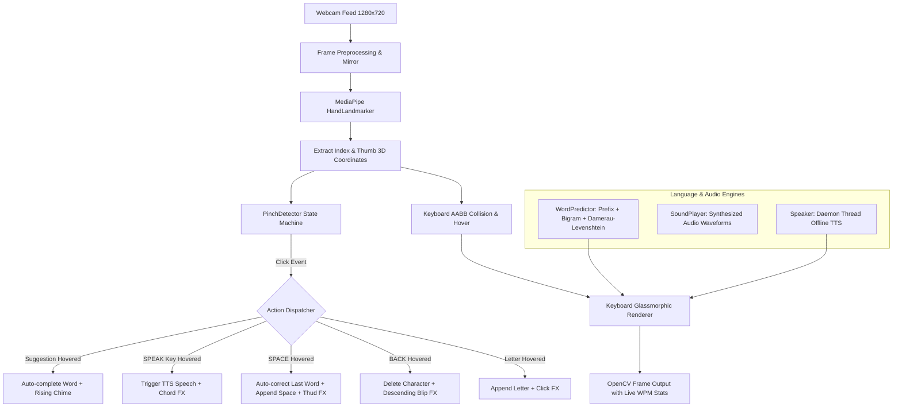

# AirType AI ✋⌨️

> An AI-powered touchless virtual keyboard — type in mid-air using hand gestures, auto-correct typos with spatial awareness, synthesize voice output, and receive real-time audio feedback.

Built with **Python · OpenCV · MediaPipe · NumPy · pyttsx3 · sounddevice** by a 2nd-year CSE-AI student documenting every engineering decision from scratch.

---

## 🎯 What It Does

- 👆 **Point & Hover**: Point your index finger at any key — key highlights green with a glassmorphism frosted effect.
- 🤏 **Pinch to Type**: Pinch index + thumb to register keypresses with zero misfire via rising-edge cooldown detection.
- 💡 **NLP Word Prediction**: Real-time 3-slot suggestion bar offering prefix completions and bigram next-word predictions.
- 🪄 **Spatial Auto-Correct**: Typo auto-correction powered by QWERTY-weighted Damerau-Levenshtein distance on `SPC` press.
- 🗣 **Offline Text-to-Speech**: Dedicated `SPEAK` button speaks typed sentences aloud asynchronously without frame drops.
- 🔊 **Synthesized Audio Feedback**: In-memory generated tones (clicks, thuds, blips, chimes, chords) for tactile-like confirmation.
- 📊 **Live Typing Telemetry**: Glassmorphic stats bar tracking live word count and calculated **WPM** (Words Per Minute).

No touch. No physical hardware. Just a standard webcam and your hands.

---

## ✅ Sprints & Features

| Sprint | Feature | Description | Status |
|--------|---------|-------------|:------:|
| **Sprint 0** | Environment & Git | Virtual environment, dependencies, project skeleton | ✅ |
| **Sprint 1** | Webcam Engine | 1280×720 normalization, mirror transformations, OOP Key structure | ✅ |
| **Sprint 2** | MediaPipe Hand Tracking | 21 3D hand landmarks via MediaPipe Tasks API | ✅ |
| **Sprint 3** | Gesture Click Engine | AABB collision, Euclidean pinch detection, rising-edge debouncing | ✅ |
| **Sprint 4** | NLP Word Prediction | Fast prefix tree-like matching + Bigram Markov language model | ✅ |
| **Sprint 5** | Spatial Auto-Correct | QWERTY Euclidean substitution cost + Damerau-Levenshtein distance | ✅ |
| **Sprint 6** | Voice Output (TTS) | Offline `pyttsx3` engine running on background daemon threads | ✅ |
| **Sprint 7** | Sound Feedback | In-memory NumPy audio synthesis (clicks, chirps, chords) via `sounddevice` | ✅ |
| **Sprint 8** | Premium UI Polish | Glassmorphism (`cv2.addWeighted`), live WPM telemetry, audio pulse ring | ✅ |

---

## 🛠 Tech Stack

| Component | Technology | Purpose |
|-----------|------------|---------|
| **Language** | Python 3.12 | Core logic & object-oriented architecture |
| **Computer Vision** | OpenCV 5.x | Frame acquisition, image mirroring, alpha blending UI rendering |
| **Machine Learning** | MediaPipe 0.10.x Tasks API | 21-point hand landmark estimation (`hand_landmarker.task`) |
| **Signal & Math** | NumPy 2.x | Digital audio synthesis (sine waves, chirps, chords) & pixel arrays |
| **Speech Synthesis** | pyttsx3 + PyObjC | Offline Text-to-Speech using native OS engines (`NSSpeechSynthesizer`) |
| **Audio Hardware** | sounddevice | Asynchronous low-latency audio buffer playback |
| **Testing** | unittest | Comprehensive 69-test automated regression suite |

---

## 🚀 Quick Start

### 1. Clone & Setup
```bash
# Clone repository
git clone https://github.com/himanshi-kumar/AirType-AI.git
cd AirType-AI

# Create and activate virtual environment
python3 -m venv .venv
source .venv/bin/activate

# Install dependencies
pip install -r requirements.txt
```

### 2. Download MediaPipe Model
```bash
# Download the 7.5MB hand landmarker model bundle
curl -L -o assets/hand_landmarker.task \
  https://storage.googleapis.com/mediapipe-models/hand_landmarker/hand_landmarker/float16/1/hand_landmarker.task
```

### 3. Run AirType AI
```bash
python3 src/main.py
```
> **Press `Q` in the application window to quit.**

### 4. Run Automated Test Suite
```bash
python3 -m unittest discover tests -v
```

---

## 📂 Project Structure

```
AirType-AI/
├── assets/
│   └── hand_landmarker.task     ← MediaPipe ML model (7.5MB)
│
├── src/
│   ├── main.py                  ← Central pipeline orchestrator (30fps loop)
│   ├── hand_detector.py         ← MediaPipe Tasks API hand landmark detector
│   ├── keyboard.py              ← UI renderer, Key/SuggestionBox classes, glassmorphism
│   ├── gesture.py               ← PinchDetector (Euclidean distance + rising-edge state machine)
│   ├── prediction.py            ← WordPredictor (prefix completion, bigram NLP, Damerau-Levenshtein)
│   ├── speech.py                ← Speaker (offline TTS daemon thread with mutex lock)
│   └── audio.py                 ← SoundPlayer (in-memory NumPy waveform synthesizer)
│
├── tests/
│   ├── test_spelling.py         ← 30 tests: DL distance, QWERTY costs, autocorrect
│   ├── test_speech.py           ← 13 tests: TTS initialization, non-blocking threads, UI keys
│   ├── test_audio.py            ← 18 tests: waveform math, amplitude bounds, fade envelopes
│   └── test_ui.py               ← 9 tests: glassmorphic alpha blending, stats bar, pulse ring
│
├── docs/
│   ├── engineering-journal/     ← Daily technical write-ups (Day-01.md to Day-09.md)
│   └── notes/                   ← Architecture & sprint specs
│
├── CHANGELOG.md                 ← Version release history (v0.1.0 to v0.8.0)
├── requirements.txt             ← Pinned project dependencies
└── README.md
```

---

## 🧠 Architecture & Pipelines



---

## 🔑 Key Algorithms & Innovations

| Innovation / Algorithm | Problem Solved | Implementation Detail |
|------------------------|----------------|-----------------------|
| **QWERTY Substitution Cost** | Physical adjacency errors in air typing | Calculates Euclidean distance between key centers; adjacent substitutions (W→E) cost $\approx 0.79$, while distant keys cost up to $1.80$. |
| **Damerau-Levenshtein Distance** | Common transpositions (`HPAP` $\rightarrow$ `HAPPY`) | 2D dynamic programming supporting insertions, deletions, substitutions, and character swaps with first-letter mismatch penalty. |
| **Rising-Edge Pinch Filter** | Accidental multi-clicks on pinch holds | State machine triggering strictly on the transition from `not_pinching` to `pinching` with a 20-frame cooldown counter. |
| **Daemon Audio & Speech Threading** | Frame-rate drops during audio synthesis | `pyttsx3.runAndWait()` isolated on background daemon threads guarded with `threading.Lock` to maintain a steady 30fps video stream. |
| **In-Memory Audio Synthesis** | Asset-free auditory feedback | Computes $\text{sample}[t] = A \sin(2\pi f t)$ with tail fade-out envelopes to prevent speaker pops without bundling `.wav` files. |
| **Glassmorphic Alpha Blending** | Opaque keyboards blocking hand visibility | Uses `cv2.addWeighted` with $\alpha = 0.55$ over frame regions of interest to render a frosted HUD interface. |

---

## 📖 Engineering Journal

Documenting the entire journey from mathematical derivations to real-time CV integration:

- 📘 [Day 01](docs/engineering-journal/Day-01.md): Project initialization, OpenCV pipeline setup, and Git workflow.
- 📘 [Day 02](docs/engineering-journal/Day-02.md): Webcam engine architecture and frame buffers as NumPy arrays.
- 📘 [Day 03](docs/engineering-journal/Day-03.md): MediaPipe Tasks API migration and normalized coordinate mapping.
- 📘 [Day 04](docs/engineering-journal/Day-04.md): AABB collision detection, Euclidean geometry, and debouncing.
- 📘 [Day 05](docs/engineering-journal/Day-05.md): Bigram Markov language modeling and UI suggestion bar.
- 📘 [Day 06](docs/engineering-journal/Day-06.md): Damerau-Levenshtein edit distance and QWERTY spatial weighting.
- 📘 [Day 07](docs/engineering-journal/Day-07.md): Asynchronous TTS architecture and thread safety with mutex locks.
- 📘 [Day 08](docs/engineering-journal/Day-08.md): DSP audio synthesis (sine waves, linear chirps, superposition).
- 📘 [Day 09](docs/engineering-journal/Day-09.md): Glassmorphic alpha compositing and parametric visual animations.

---

## 🧪 Testing & Verification

AirType AI includes a test suite covering all modules:

```bash
# Run all 69 unit tests
.venv/bin/python -m unittest discover tests -v
```

```
Ran 69 tests in 1.376s

OK (100% Passing)
```

---

## 📜 License

This project is open-source and available under the [MIT License](LICENSE).